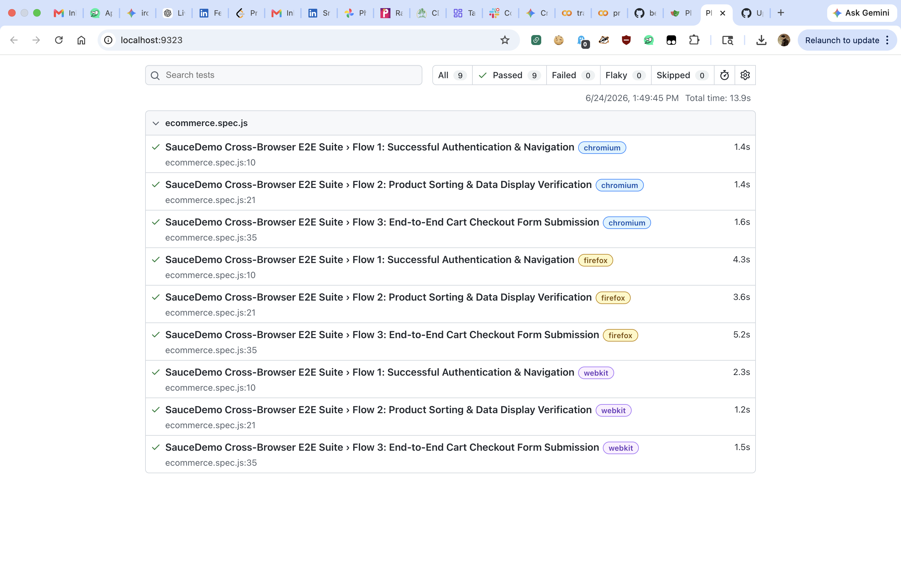

# Playwright Cross-Browser UI Automation Suite

This repository contains an automated UI testing framework built with **Playwright** and **JavaScript**. It executes end-to-end user flows across multiple browser engines simultaneously to guarantee cross-browser layout and functionality compatibility.

## Prerequisites

Ensure you have the following installed locally:
- [Node.js](https://nodejs.org/) (v18 or higher recommended)
- npm (comes packaged with Node)

---

## Setup Process

1. **Clone the repository:**
```bash
   git clone <your-repository-url>
   cd playwright-cross-browser


2. **Install project dependencies:**
npm install

3. **Install Playwright Browser Binaries:**
This command downloads the exact browser binaries (Chromium, Firefox, and WebKit) optimized for your current OS:

npx playwright install

4. **Test Application**
The test suite targets the SauceLabs Demo Application: https://www.saucedemo.com

Covered User Flows
Flow 1: Successful Authentication & Inventory Page Navigation.

Flow 2: Product Sorting Dropdown functionality and Data Display verification.

Flow 3: End-to-End Item Cart Checkout Form submission.

Cross-Browser Configuration
The framework is configured via playwright.config.js to execute across three desktop matrix profiles under the projects block:

Chromium (Google Chrome engine)

Firefox (Mozilla engine)

WebKit (Apple Safari engine)

By default, tests run concurrently across all projects to maximize performance.

5. **Test Execution Commands**
Run the following scripts from the root directory to initiate test runs:

Run all tests on all browsers (Parallel Matrix):
npm test

Run tests exclusively on Chromium:
npm run test:chromium

Run tests exclusively on Firefox:
npm run test:firefox

Run tests exclusively on WebKit (Safari Engine):
npm run test:webkit

**Viewing Test Reports**
After a test execution completes, an interactive HTML report provides visual pass/fail metrics broken down by individual browser execution profiles. To open the report locally:
npm run test:report

## Test Execution Results

Here is the successful cross-browser execution matrix showing all 9 test variants passing concurrently:


